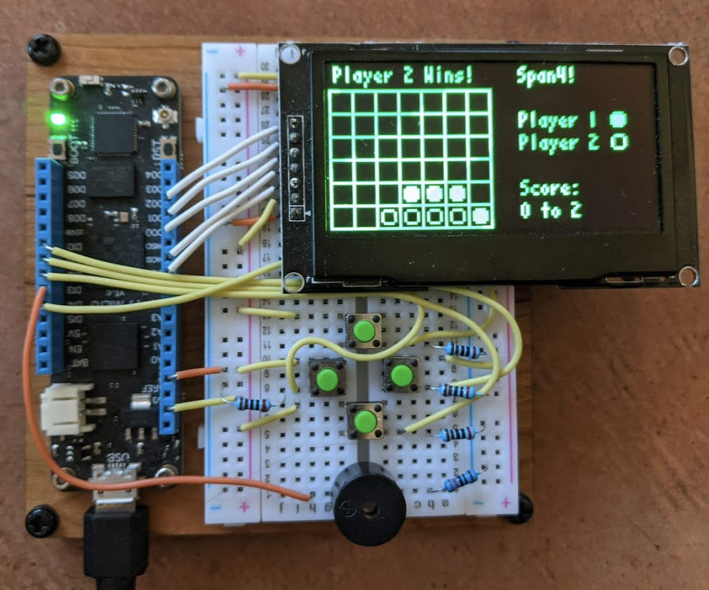
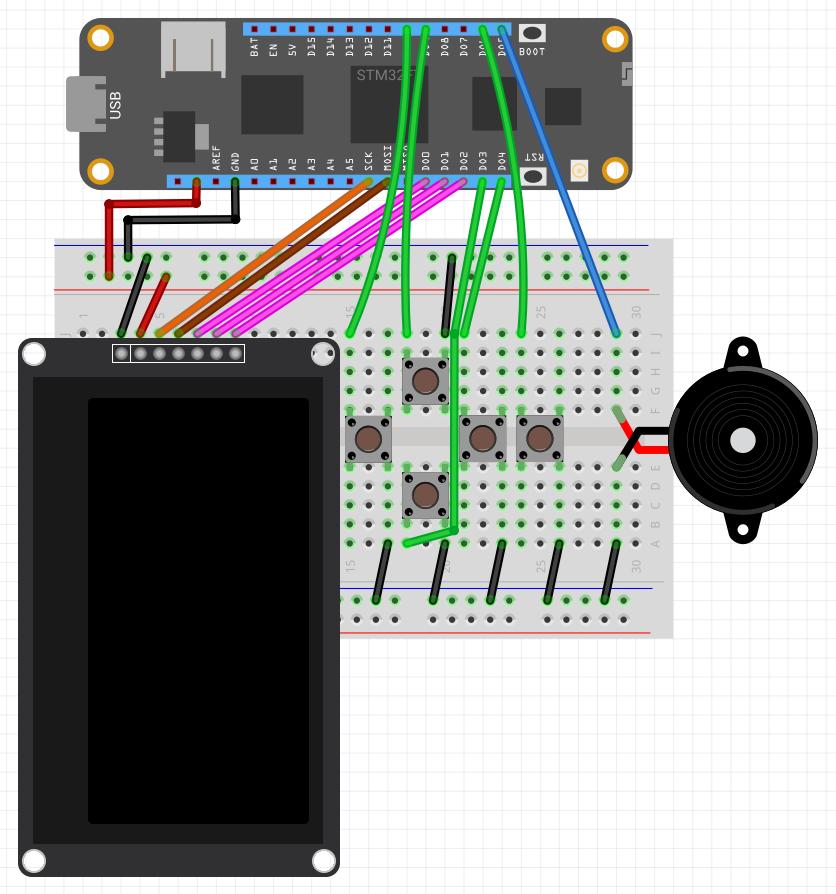
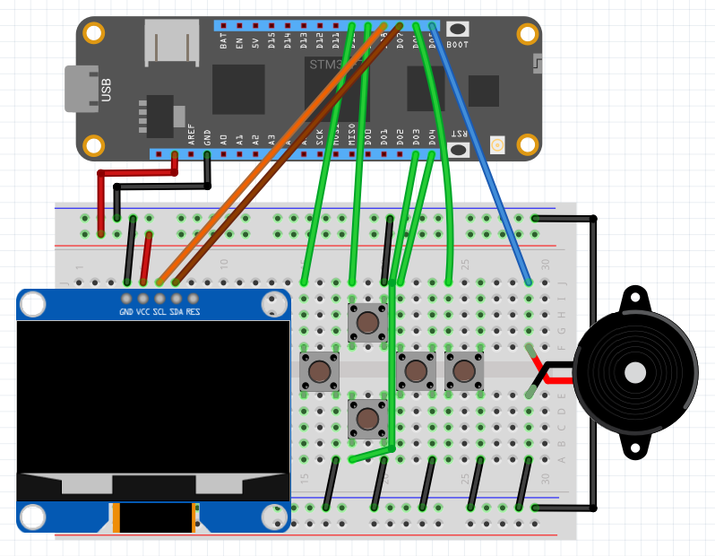

# Juego

## Compiling

When using the develop branch, you'll need to check out several additional Meadow repos:

Meadow.Core
Meadow.Units2
Meadow.Contracts
Meadow.Foundation
Meadow.Logging

All repos available here: https://github.com/wildernesslabs/

You will need to clone all repos including Juego at the same folder level and set all repos to the develop branch.

Also, make sure you are running the latest version of Meadow OS on your Jeugo v2 board.

## Testing Juego

To validate your Juego hardware, connect your Juego, and deploy the Juego_Demo application.

## Juego Prototype

This was an early hardware project to create a Meadow handheld multi-game project designed to work with 128x64 single color displays (SSD1306 or SSD1309)

Includes five games:

- FrogIt
- Pong
- Span4 (2-player match 4 game)
- Snake
- Tetraminos (inspired by Tetris)

## Fritzing Diagram with SSD1309 (SPI Connection)

## Fritzing Diagram with SSD1309 (I2C Connection)

