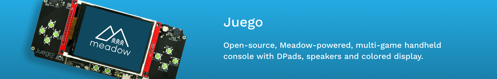

# Juego

Open-source, Meadow-powered, multigame handheld console with DPads, speakers and a colored display.

#### Are you brand new to Meadow?

If you've never deployed a Meadow app before, you'll want to check out the [Getting Started Guide](https://developer.wildernesslabs.co/Meadow/Getting_Started/) which will get your development environment up and running and validate that you can build and deploy.

## Contents
* [Purchasing or Building](#purchasing-or-building)
* [Getting Started](#getting-started)
* [Hardware Specifications](#hardware-specifications)
* [Additional Samples](#additional-samples)
* [Juego Hack Kit Version](#juego-hack-kit-version)
* [Support](#support)

## Purchasing or Building

<table width="100%">
    <tr>
        <td>
            
        </td>
        <td>
             
        </td>
    </tr>
    <tr>
        <td>
            You can get a Juego board from the <strong><a href="https://store.wildernesslabs.co/collections/frontpage/products/juego">Wilderness Labs store</a></strong>.
        </td>
        <td> 
            You can also build a simpler Juego using a monocolor display and push buttons.
        </td>
    </tr>
</table>

## Getting Started

### Playing Juego

Do you have a brand new Juego and you just wanna play some games? Check out the [Juego.Samples repo](https://github.com/WildernessLabs/Juego.Samples) with some games you can play out of the box.

#### Are you brand new to Meadow?

If you've never deployed a Meadow app before, you'll want to check out the [Getting Started Guide](https://developer.wildernesslabs.co/Meadow/Getting_Started/) which will get your development environment up and running and validate that you can build and deploy.

### Using the Juego Hardware in your own App

To make using the hardware even simpler, we've created a [NuGet package](https://www.nuget.org/packages/Meadow.Juego) that instantiates and encapsulates the onboard hardware into a `Juego` class.

1. Add the ProjectLab Nuget package your project: 
    - `dotnet add package Meadow.Juego`, or
    - [Meadow.Juego Nuget Package](https://www.nuget.org/packages/Meadow.Juego)
    - [Explore in Fuget.org](https://www.fuget.org/packages/Meadow.Juego/0.1.0/lib/netstandard2.1/Juego.dll/Meadow.Devices/Juego)

2. Instantiate the Juego class:
```csharp
public class MeadowApp : App<F7CoreComputeV2>
{
    IJuegoHardware juego;

    public override Task Initialize()
    {
        juego = Juego.Create();
        ...
```

3. Access `Juego`'s onboard peripherals.

- To create a MicroGraphics object with Juego's Display:
```csharp
    ...
    if (juego.Display is { } display)
    {
        graphics = new MicroGraphics(display)
        {
            IgnoreOutOfBoundsPixels = true,
            CurrentFont = new Font12x16()
        };
        ....
    }
    ...
```

- To instantiate Juego's Select and Start buttons:
```csharp
    ...
    if (juego.SelectButton is { } selectButton)
    {
        selectButton.PressStarted += (s, e) => { ... };
        selectButton.PressEnded += (s, e) => { ... };
    }

    if (juego.StartButton is { } startButton)
    {
        startButton.PressStarted += (s, e) => { ... };
        startButton.PressEnded += (s, e) => { ... };
    }
    ...
```
- To use Juego's speakers:
```csharp
    ...
    for (int i = 0; i < 5; i++)
    {
        await juego.LeftSpeaker.PlayTone(
            new Frequency(440), TimeSpan.FromMilliseconds(500));
        await juego.RightSpeaker.PlayTone(
            new Frequency(540), TimeSpan.FromMilliseconds(500));
    }
    ...
```


## Hardware Specifications


<table>
    <tr>
        <td><strong>ILI9341</strong> - 240x320 RGB LED display</td>
    </tr>
    <tr>
        <td><strong>Magnetic Audio Transducers</strong> - A pair of High quality piezo speakers</td>
    </tr>
    <tr>
        <td><strong>DPads</strong> - Directional Pads on either side of the display.</td>
    </tr>
    <tr>
        <td><strong>Select/Start Buttons</strong> - Classical Select and Start buttons</td>
    </tr>
    <tr>
        <td><strong>USB-C port</strong> - Port used to build/deploy apps to Juego</td>
    </tr>
    <tr>
        <td><strong>Rechargable Battery Slot</strong> - To play on the go</td>
    </tr>
    <tr>
        <td><strong>On/Off switch</strong> - Used to turn the Juego on and off</td>
    </tr>
</table>

You can find the schematics and other design files in the [Hardware folder](Source/Hardware).

## Additional Samples

1. **[Setup your Meadow Build Environment](http://developer.wildernesslabs.co/Meadow/Getting_Started/Deploying_Meadow/)** - If you haven't deployed a Meadow app before, you'll need to setup your IDE extension(s), deploy Meadow.OS, etc.
2. **[Run the Demo App](Source/Juego_Demo/)** - Deploy the Juego demonstration app to see the built in peripherals at work.
3. **[Check out the Juego.Samples repo](https://github.com/WildernessLabs/Juego.Samples)** - We recommend cloning the [Juego.Samples](https://github.com/WildernessLabs/Juego.Samples) repo. There you'll find a bunch of awesome samples that you can run right out-of-the box! 
<a href="https://github.com/WildernessLabs/Juego.Samples">
    
</a>

## Juego Hack Kit Version

This was an early hardware project to create a Meadow handheld multi-game project designed to work with 128x64 or 320x240 single color displays (SSD1306 or SSD1309)

Includes five games:

- FrogIt
- Pong
- Span4 (2-player match 4 game)
- Snake
- Tetraminos (inspired by Tetris)


### Fritzing Diagrams of Juego using a Meadow Dev Kit

<table width="100%">
    <tr>
        <td>
            
        </td>
        <td>
             
        </td>
    </tr>
    <tr>
        <td>
            Juego using a SSD1309 Display connected via SPI and Push Buttons.
        </td>
        <td> 
            Juego using a SSD1309 Display connected via I2C and Push Buttons.
        </td>
    </tr>
</table>

## Support

Having trouble building/running these projects? 
* File an [issue](https://github.com/WildernessLabs/Meadow.Desktop.Samples/issues) with a repro case to investigate, and/or
* Join our [public Slack](http://slackinvite.wildernesslabs.co/), where we have an awesome community helping, sharing and building amazing things using Meadow.